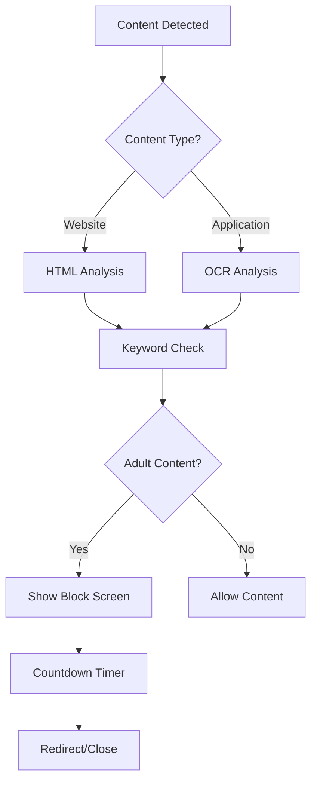

# 🛡️ Adult Content Blocker System

A comprehensive adult content blocking system that integrates seamlessly with your PyQt5 application. This system monitors both web content and applications using advanced detection techniques to protect users from inappropriate material.

## 🎯 Features

### 🌐 Web Content Blocking
- **Website Analysis**: Deep analysis of HTML content, titles, meta descriptions, and headers
- **Video Content Detection**: Checks video titles, descriptions, and metadata
- **Image Content Filtering**: Examines image titles, alt text, and surrounding content
- **Domain-Based Blocking**: Maintains a database of known adult content domains
- **Advanced Keyword Detection**: Sophisticated keyword matching with context awareness
- **Real-Time Browser Monitoring**: Continuous monitoring of browser activity

### 🖥️ Application Monitoring
- **OCR Technology**: Uses Optical Character Recognition to scan screen content
- **Real-Time Screen Analysis**: Continuously monitors active application windows
- **Process Detection**: Identifies and manages running applications
- **Cross-Platform Support**: Works on Windows, macOS, and Linux

### 🚫 Block Screen System
- **Full-Screen Blocking**: Takes over the entire screen when inappropriate content is detected
- **Configurable Countdown**: Customizable timer before automatic action
- **Custom Messages**: Personalized blocking messages from UI settings
- **Smart Actions**: 
  - **Browsers**: Redirects to safe URL after countdown
  - **Applications**: Closes the blocked application
- **Bypass Prevention**: Disables common bypass methods during blocking

### 📊 Logging & Analytics
- **Comprehensive Logging**: Records all blocking events with timestamps
- **Activity Statistics**: Tracks blocking patterns and frequency
- **Export Capabilities**: Data can be exported for analysis
- **Privacy-Focused**: All processing happens locally

## 🚀 Quick Start

### 1. Installation

First, install the required dependencies:

```bash
pip install -r requirements_content_blocker.txt
```

**Additional Requirements:**
- **Tesseract OCR**: Required for application monitoring
  - Windows: [Download from UB-Mannheim](https://github.com/UB-Mannheim/tesseract/wiki)
  - Ubuntu/Debian: `sudo apt-get install tesseract-ocr tesseract-ocr-eng`
  - macOS: `brew install tesseract`

### 2. Integration with Existing Application

The content blocker is designed to integrate with your existing PyQt5 application. Follow these steps:

#### Step 1: Add the Integration
Add this import to your `main_window.py`:

```python
from src.utils.content_blocker_integration import setup_content_blocker_integration
```

#### Step 2: Initialize in MainWindow
Add this to your `MainWindow.__init__` method:

```python
# Initialize adult content blocker
try:
    self.content_blocker_integration = setup_content_blocker_integration(self)
    if self.content_blocker_integration:
        print("✅ Adult content blocker initialized successfully")
except Exception as e:
    print(f"⚠️  Content blocker initialization error: {e}")
    self.content_blocker_integration = None
```

#### Step 3: UI Elements (Already in your UI)
The system automatically connects to these UI elements:
- **Enable/Disable**: `checkBox` (Block Adult Content)
- **Countdown Timer**: `spinBox` (Block Screen Countdown)
- **Redirect URL**: `lineEdit_2` (Block Screen URL)
- **Custom Message**: `plainTextEdit` (Block Screen Message)

### 3. Testing the System

Run the test application to verify everything works:

```bash
python test_content_blocker.py
```

This provides a complete test interface where you can:
- Toggle content blocking on/off
- Configure all settings
- Test the block screen
- Monitor activity logs
- Test keyword detection

## 🔧 Configuration

### UI Settings Integration

The content blocker automatically reads settings from your UI:

| UI Element | Purpose | Default Value |
|------------|---------|---------------|
| `checkBox` | Enable/disable blocking | Checked |
| `spinBox` | Countdown duration | 10 seconds |
| `lineEdit_2` | Redirect URL | https://google.com |
| `plainTextEdit` | Block message | Custom message |

### Advanced Configuration

You can programmatically configure the blocker:

```python
# Get the blocker instance
from src.utils.adult_content_blocker import get_blocker_instance
blocker = get_blocker_instance()

# Add custom keywords
blocker.add_custom_keyword("inappropriate_term", "adult", severity=3)

# Add custom domains
blocker.add_custom_domain("blocked-site.com", "adult", severity=3)

# Configure settings
blocker.default_countdown = 15
blocker.default_redirect_url = "https://safe-site.com"
blocker.default_block_message = "Custom blocking message"
```

## 🛠️ How It Works

### Detection Pipeline



### Web Content Analysis

1. **Domain Checking**: Compares URLs against database of blocked domains
2. **Content Fetching**: Downloads webpage content for analysis
3. **HTML Parsing**: Extracts titles, meta descriptions, headers, and text
4. **Keyword Matching**: Checks content against comprehensive keyword database
5. **Context Analysis**: Considers surrounding content for accuracy
6. **Decision Making**: Determines if content should be blocked

### Application Monitoring

1. **Screen Capture**: Takes periodic screenshots of active windows
2. **OCR Processing**: Extracts text using Tesseract OCR engine
3. **Text Analysis**: Analyzes extracted text for inappropriate content
4. **Process Identification**: Identifies the source application
5. **Action Execution**: Closes application if content is inappropriate

### Block Screen Process

1. **Immediate Response**: Full-screen overlay appears within milliseconds
2. **Information Display**: Shows blocking reason and source
3. **Countdown Timer**: Configurable delay before action
4. **User Message**: Displays custom message from settings
5. **Automatic Action**: Redirects browsers or closes applications
6. **Logging**: Records incident for monitoring

## 📁 File Structure

```
src/utils/
├── adult_content_blocker.py          # Main blocker system
├── content_blocker_integration.py    # UI integration layer
└── database.py                       # Existing database utilities

GUI/
└── App GUI.ui                        # UI definition (existing)

Root/
├── test_content_blocker.py           # Test application
├── requirements_content_blocker.txt  # Dependencies
├── main_window_integration_patch.py  # Integration guide
└── CONTENT_BLOCKER_README.md         # This documentation
```

## 🔒 Security Features

### Bypass Prevention
- **Full-Screen Mode**: Prevents window switching during blocking
- **Keyboard Blocking**: Disables Alt+Tab, Alt+F4, and other shortcuts
- **Process Monitoring**: Detects attempts to kill the blocker process
- **Administrative Mode**: Can require admin privileges for full protection

### Privacy Protection
- **Local Processing**: All analysis happens on the local machine
- **No External Communication**: Content is not sent to external servers
- **Encrypted Storage**: Sensitive data is encrypted in the database
- **Minimal Logging**: Only essential information is recorded

## 📊 Database Schema

The system uses SQLite with these tables:

```sql
-- Blocked keywords with categories and severity
CREATE TABLE blocked_keywords (
    id INTEGER PRIMARY KEY,
    keyword TEXT UNIQUE,
    category TEXT,
    severity INTEGER
);

-- Blocked domains  
CREATE TABLE blocked_domains (
    id INTEGER PRIMARY KEY,
    domain TEXT UNIQUE,
    category TEXT,
    severity INTEGER
);

-- Activity logs
CREATE TABLE block_logs (
    id INTEGER PRIMARY KEY,
    timestamp DATETIME DEFAULT CURRENT_TIMESTAMP,
    content_type TEXT,
    content_source TEXT,
    block_reason TEXT,
    app_name TEXT
);
```

## 🧪 Testing & Debugging

### Test Modes

1. **Interactive Testing**: Use `test_content_blocker.py`
2. **Keyword Testing**: Test specific text for adult content
3. **URL Testing**: Test websites for blocking
4. **Block Screen Testing**: Test the full-screen block interface

### Debug Information

Enable detailed logging:

```python
import logging
logging.basicConfig(level=logging.DEBUG)
```

### Common Test Cases

```python
# Test keyword detection
blocker = get_blocker_instance()
result = blocker._contains_adult_content("test text here")

# Test domain blocking
is_blocked = blocker._is_domain_blocked("example.com")

# Test block screen
from src.utils.adult_content_blocker import BlockScreen
screen = BlockScreen("Website", "test.com", "Test reason")
screen.show()
```

## 🔧 Troubleshooting

### Common Issues

#### OCR Not Working
```bash
# Check Tesseract installation
tesseract --version

# Install language packs (Ubuntu/Debian)
sudo apt-get install tesseract-ocr-eng

# Set Tesseract path (Windows)
pytesseract.pytesseract.tesseract_cmd = r'C:\Program Files\Tesseract-OCR\tesseract.exe'
```

#### Browser Monitoring Limited
- Browser security restrictions limit access to active tab content
- Consider developing browser extensions for enhanced monitoring
- Use domain-based blocking as primary method

#### Performance Issues
```python
# Adjust monitoring frequency
blocker.monitoring_interval = 2  # seconds

# Optimize keyword database
blocker.optimize_keyword_database()

# Reduce OCR frequency
blocker.ocr_interval = 5  # seconds
```

#### Permission Errors
- Run application as administrator (Windows) or with sudo (Linux/macOS)
- Check antivirus software for interference
- Ensure proper file permissions for database

### Debug Mode

```python
# Enable comprehensive debugging
from src.utils.adult_content_blocker import get_blocker_instance
blocker = get_blocker_instance()
blocker.debug_mode = True
blocker.log_level = "DEBUG"
```

## 🚀 Advanced Usage

### Custom Keyword Lists

```python
# Add industry-specific keywords
blocker.add_keyword_category("gambling", [
    "casino", "poker", "betting", "slots", "jackpot"
])

# Add severity levels
blocker.set_keyword_severity("extreme_content", 5)
```

### Whitelist Management

```python
# Add educational exceptions
blocker.add_whitelist_domain("educational-site.edu")
blocker.add_whitelist_keyword("medical_term")

# Temporary whitelist
blocker.add_temporary_whitelist("research-site.com", duration=3600)  # 1 hour
```

### Custom Actions

```python
# Define custom blocking actions
def custom_block_action(content_type, source, reason):
    # Send notification to parent/administrator
    send_notification(f"Blocked: {source}")
    # Log to external system
    log_to_external_system(content_type, source, reason)

blocker.set_custom_action(custom_block_action)
```

### Integration with Parental Controls

```python
# Schedule-based blocking
blocker.set_schedule({
    "weekdays": {"start": "09:00", "end": "17:00"},
    "weekends": {"start": "10:00", "end": "20:00"}
})

# Age-appropriate filtering
blocker.set_age_filter(age=13)  # Adjusts keyword sensitivity
```

## 📈 Performance Optimization

### System Requirements
- **RAM**: Minimum 4GB, recommended 8GB+
- **CPU**: Multi-core processor recommended for OCR processing
- **Storage**: 100MB for database and logs
- **Network**: No internet required for core functionality

### Optimization Tips

1. **Keyword Database**: Regularly optimize and clean the keyword database
2. **OCR Frequency**: Adjust based on system performance
3. **Browser Monitoring**: Use domain-based blocking for better performance
4. **Logging**: Rotate logs to prevent database growth

## 🤝 Contributing

### Adding New Detection Methods

1. Create new detection class inheriting from `ContentDetector`
2. Implement required methods: `analyze()`, `is_inappropriate()`
3. Register with the main blocker system
4. Add comprehensive tests

### Improving Accuracy

1. **Machine Learning**: Integrate ML models for better content classification
2. **Context Analysis**: Improve understanding of content context
3. **False Positive Reduction**: Add smarter whitelisting logic
4. **Language Support**: Add support for multiple languages

### Browser Extensions

Consider developing browser extensions for enhanced monitoring:
- Chrome Extension API
- Firefox WebExtensions
- Safari App Extensions

## 📄 Legal Considerations

### Usage Guidelines
- **Parental Use**: Designed for parents monitoring minor children
- **Organizational Use**: Suitable for schools and workplaces with proper policies
- **Privacy Compliance**: Ensure compliance with local privacy laws
- **Transparency**: Users should be aware of monitoring

### Limitations
- **Not 100% Accurate**: No automated system can catch all inappropriate content
- **Context Matters**: Some legitimate content may be flagged
- **Technical Limitations**: Browser security may limit monitoring capabilities
- **Regular Updates**: Keyword databases need regular maintenance

### Disclaimer
This software is provided as-is for content filtering purposes. Users are responsible for:
- Ensuring legal compliance in their jurisdiction
- Respecting privacy rights of monitored users
- Understanding the limitations of automated content filtering
- Maintaining and updating the system appropriately

## 📞 Support

### Getting Help
1. **Documentation**: Check this README and inline code comments
2. **Test Application**: Use `test_content_blocker.py` for troubleshooting
3. **Debug Logs**: Enable debug mode for detailed information
4. **Community**: Share experiences and solutions with other users

### Reporting Issues
When reporting issues, please include:
- Operating system and version
- Python and PyQt5 versions
- Complete error messages
- Steps to reproduce the issue
- Screenshots if applicable

---

**Version**: 1.0.0  
**Last Updated**: 2024  
**Compatibility**: Python 3.7+, PyQt5 5.15+  
**License**: Use according to your project's license terms